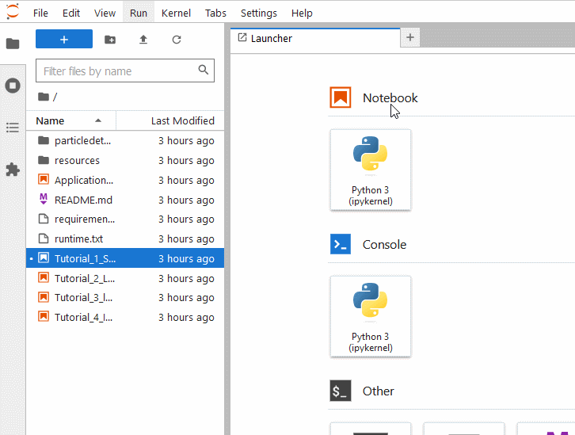

# Quelques explications sur l'environnement de développement !

L'environnement dans lequel vous créez du code Python s'appelle [__Jupyter__](https://jupyter.org/) et est constitué de _cellules_ pouvant contenir du texte formatté ou du code Python (voire d'autres langages de programmation, par exemple du R ou du Julia). 

Contrairement à du code Python 'brut' constitué de fichiers `.py`, ici, vous disposez d'un _noyau_ Python interactif qui s'exécute en arrière-plan et va retenir les variables une fois que les cellules sont exécutées, un peu à la manière de MATLAB. C'est également Jupyter qui fait que le contenu des variables s'affiche par défaut quand vous écrivez juste `ma_variable` dans une cellule. 

Jupyter s'exécute normalement sur votre ordinateur, _en local_, en utilisant votre version à vous de Python. Cela paraît un peu bizarre, car il ouvre votre navigateur web préféré et crée des pages interactives. Mais celles-ci fonctionneront sans problème même si vous n'avez pas de connexion internet.

Dans notre cas particulier, j'utilise [Binder](#https://mybinder.org/) qui permet de transformer ces 'projets' Jupyter hors-ligne vers des projets _réellement en ligne_, où en fait c'est un _serveur_ qui nous laisse gracieusement utiliser ses ressources Python. Comme ça, vous n'avez pas à installer quoi que ce soit ! 

--------------------------

## Navigation 

Le contenu à l'intérieur des tutoriels est hiérarchisé, vous pouvez accéder à la structure de chacun des documents, y compris celui-ci et celui du fichier [Readme](./Readme.md) (le 'lisez-moi'), en cliquant sur l'onglet `Table of Contents` à gauche de votre interface. Je vous montre : 

-----------------------------

## Raccourcis clavier 

Cliquez une fois à l'intérieur des cellules contenant du code pour éditer le code en question, le modifier, ou commenter des choses.  
