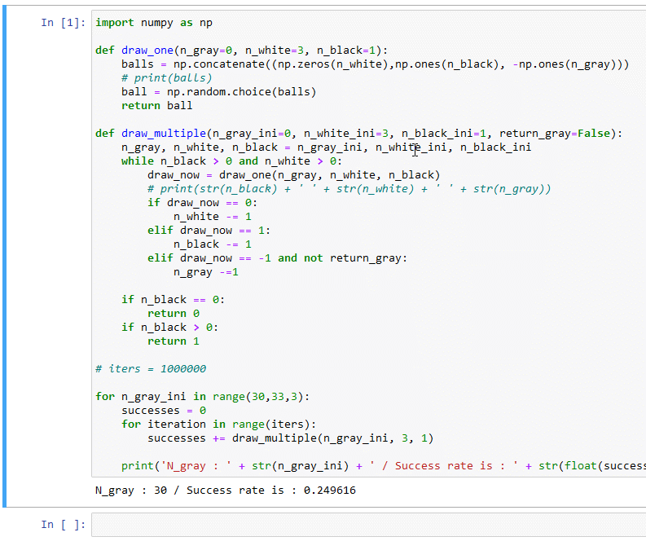
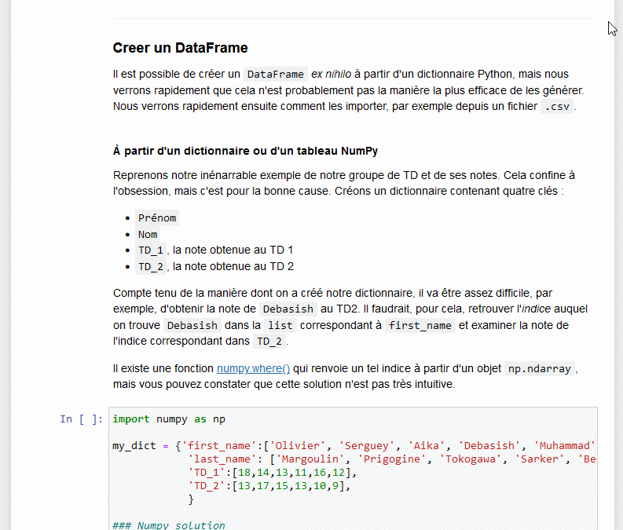
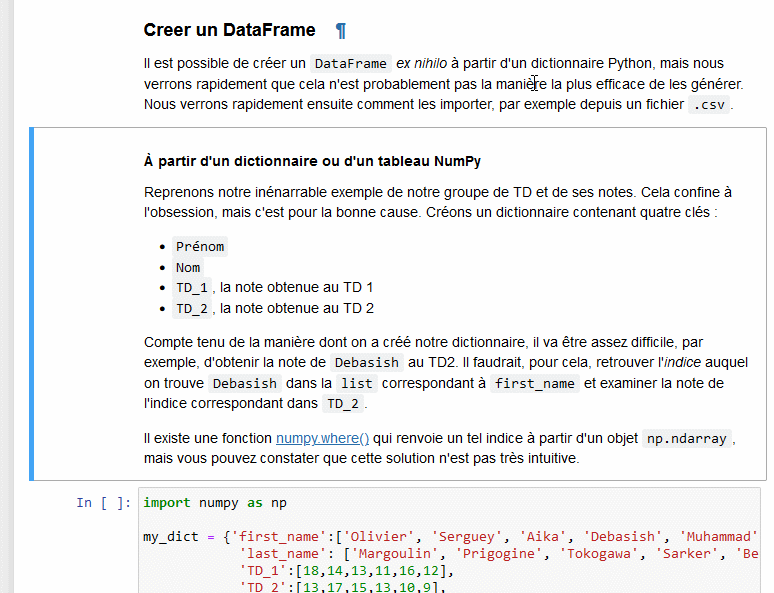
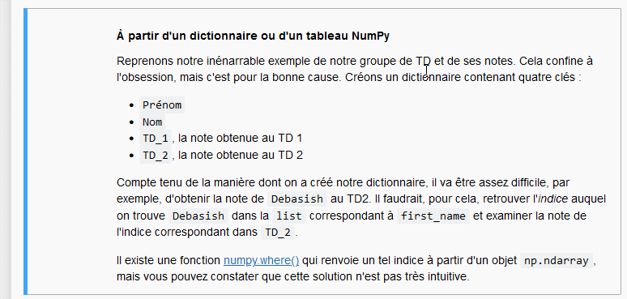

# FAQ

Dans ce document, je réponds à quelques interrogations sur le 'logiciel' (l'_environnement_) avec lequel vous faites du Python. Je vous indique également quels sont les raccourcis clavier de l'environnement qui vous permettront d'être plus rapide et efficace !

## Quelques explications sur l'environnement de développement !

L'environnement dans lequel vous créez du code Python s'appelle [__Jupyter__](https://jupyter.org/) et est constitué de _cellules_ pouvant contenir du texte formatté ou du code Python (voire d'autres langages de programmation, par exemple du R ou du Julia). 

Contrairement à du code Python 'brut' constitué de fichiers `.py`, ici, vous disposez d'un _noyau_ Python interactif qui s'exécute en arrière-plan et va retenir les variables une fois que les cellules sont exécutées, un peu à la manière de MATLAB. C'est également Jupyter qui fait que le contenu des variables s'affiche par défaut quand vous écrivez juste `ma_variable` dans une cellule. 

Jupyter s'exécute normalement sur votre ordinateur, _en local_, en utilisant votre version à vous de Python. Cela paraît un peu bizarre, car il ouvre votre navigateur web préféré et crée des pages interactives. Mais celles-ci fonctionneront sans problème même si vous n'avez pas de connexion internet.

Dans notre cas particulier, j'utilise [Binder](#https://mybinder.org/) qui permet de transformer ces 'projets' Jupyter hors-ligne vers des projets _réellement en ligne_, où en fait c'est un _serveur_ qui nous laisse gracieusement utiliser ses ressources Python. Comme ça, vous n'avez pas à installer quoi que ce soit ! 

--------------------------

## Comment accéder à la table des matières ?

Le contenu à l'intérieur des tutoriels est hiérarchisé, vous pouvez accéder à la structure de chacun des documents, y compris celui-ci et celui du fichier [Readme](./Readme.md) (le 'lisez-moi'), en cliquant sur l'onglet `Table of Contents` à gauche de votre interface. Je vous montre : 

-----------------------------

## Quels sont les raccourcis clavier ?

### Éditer les cellules de code et de texte

Cliquez une fois à l'intérieur des cellules contenant du code pour éditer le code en question, le modifier, ou commenter des choses. Par exemple, vous pouvez commenter des blocs de texte en les sélectionant et en appuyant ensuite sur `Ctrl` (`Cmd` sous Mac) et la touche `/` du pavé numérique. Si vous n'avez pas de pavé numérique, c'est plus compliqué : vous devrez appuyer sur `Alt` et la maintenir enfoncée, puis cliquez sur votre souris et laissez le clic enfoncé également, puis bougez votre souris le long des lignes que vous voulez commenter. La combinaison `Alt + Clic` va 'démultiplier' votre pointeur, et vous pouvez alors facilement commenter ou dé-commenter de nombreuses lignes avec le caractère `#`: 

Pour éditer des cellules de texte, vous pouvez double-cliquer dessus. Dans ce cas, vous avec accès au contenu de celles-ci, qui est rédigé en [Markdown](https://www.markdownguide.org/), un type de formatage léger qui reste assez lisible même pour les néophytes. Il est possible d'inclure du contenu mathématique $\LaTeX{}$ dans vos cellules en utilisant les symboles traditionnels `$` pour du code en ligne et `$$` pour du code _façon équation_. 

Quand vous êtes effectivement dans une cellule, vous constaterez que le liseré à gauche de la cellule devient vert.

Pour sortir d'une cellule, vous devrez appuyer sur `Échap` ou `Ctrl + Entrée` afin de revenir à la __navigation en cellules__. Le liseré à gauche de votre cellule devrait alors re-devenir bleu. 

### Navigation en cellules 

Une fois que vous êtes dans la navigation en cellules, vous pouvez copier et coller des cellules déjà existantes en utilisant les touches `C` et `V` (sans `Ctrl`). 

Vous pouvez également les couper en utilisant la touche `X`, et les supprimer en utilisant la touche `D`, puis en confirmant avec un nouvel appui sur `D`. Vous pouvez accéder à la cellule supérieure ou inférieure avec les flèches de votre clavier `↑` et `↓`. 

Vous pouvez couper, copier et coller plusieurs cellules. Pour cela, appuyez d'abord sur `Shift` et sélectionnez autant de cellules que vous voulez copier/couper puis collez-les ailleurs !

Vous pouvez enfin créer des nouvelles cellulles au-dessus (_above_) de la cellule actuelle avec la touche `A` et des nouvelles cellules en-dessous (_below_) de la cellule actuelle avec la touche `B`.

### Convertir des cellules : du texte au code

Les cellules de code peuvent être converties en cellules de texte en appuyant sur `M` __dans la navigation en cellules__. À l'inverse, vous pouvez convertir une cellule de texte en cellule de code en utilisant la touche `Y`. Dans le code suivant, je fais d'abord un clic simple sur ma cellule et un appui sur `Y` pour formatter ma cellule de texte en code ; j'appuie ensuite sur `M` et enfin sur `Ctrl + Entrée` pour la re-formatter proprement en texte.

